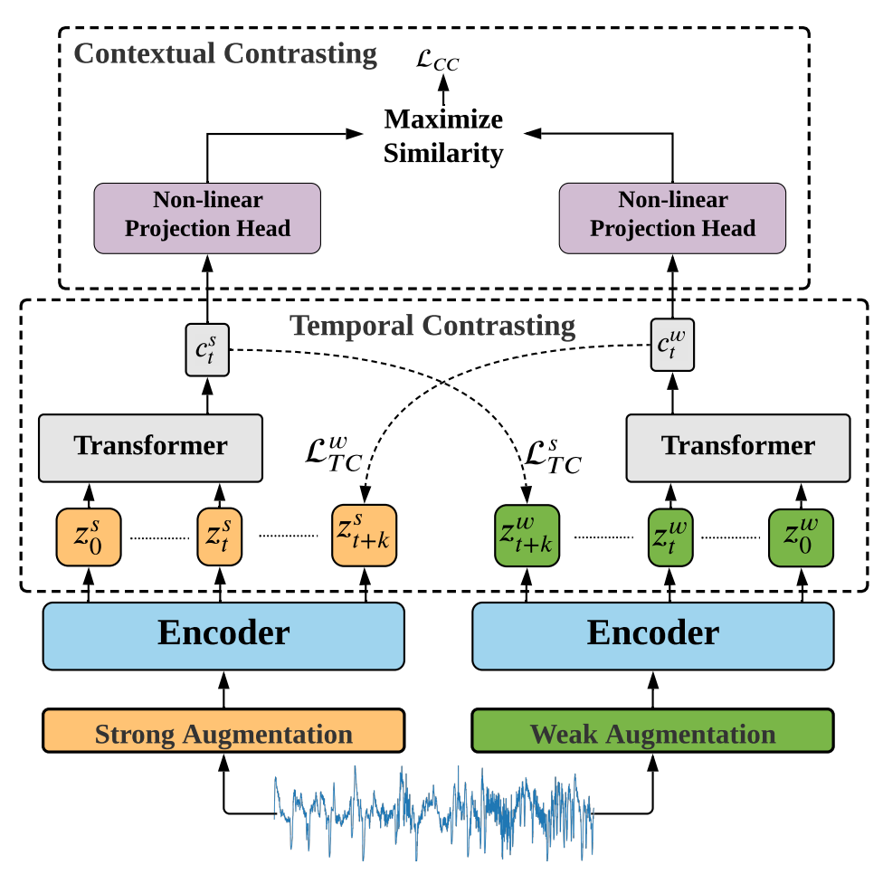

# TS-TCC: Time-Series Representation Learning via Temporal and Contextual Contrasting
### Implementation of the IJCAI-21 work: "Time-Series Representation Learning via Temporal and Contextual Contrasting"
#### *by: Emadeldeen Eldele, Mohamed Ragab, Zhenghua Chen, Min Wu, Chee Keong Kwoh, Xiaoli Li and Cuntai Guan*

## Abstract

Learning decent representations from unlabeled time-series data with temporal dynamics is a very challenging task. 
In this paper, we propose an unsupervised <b>T</b>ime-<b>S</b>eries representation learning framework via <b>T</b>emporal and <b>C</b>ontextual <b>C</b>ontrasting 
(<b>TS-TCC</b>), to learn time-series representation from unlabeled data. 
First, the raw time-series data are transformed into two different yet correlated views by using weak and strong augmentations. 
Second, we propose a novel temporal contrasting module to learn <i>robust</i> temporal representations by designing a tough cross-view prediction task. 
Last, to further learn <i>discriminative</i> representations, we propose a contextual contrasting module built upon the 
contexts from the temporal contrasting module. It attempts to maximize the similarity among different contexts of the same sample while minimizing 
similarity among contexts of different samples. Experiments have been carried out on three real-world time-series datasets. 
The results manifest that training a linear classifier on top of the features learned by our proposed TS-TCC performs 
comparably with the supervised training. Additionally, our proposed TS-TCC shows high efficiency in few-labeled data and transfer learning scenarios. 


## Requirmenets:
- Python3.x
- Pytorch==1.7
- Numpy
- Sklearn
- Pandas
- openpyxl (for classification reports)
- mne (For Sleep-EDF preprocessing)

## Datasets
### Download datasets
We used four public datasets in this study:
- [Sleep-EDF](https://physionet.org/content/sleep-edfx/1.0.0/)
- [HAR](https://archive.ics.uci.edu/ml/datasets/Human+Activity+Recognition+Using+Smartphones)  
- [Epilepsy](https://archive.ics.uci.edu/ml/datasets/Epileptic+Seizure+Recognition)
- [Fault Diagnosis](https://mb.uni-paderborn.de/en/kat/main-research/datacenter/bearing-datacenter/data-sets-and-download)

### Preparing datasets
After downloading the datasets, you can prepare them using preprocessing codes.

The data should be in a separate folder called "data" inside the project folder.

Inside that folder, you should have a separate folders; one for each dataset. Each subfolder should have "train.pt", "val.pt" and "test.pt" files.

The structure of data files should in dictionary form as follows:
`train.pt = {"samples": data, "labels: labels}`, and similarly `val.pt`, and `test.pt`

### Configurations
The configuration files in the `config_files` folder should have the same name as the dataset folder name.
For example, for HAR dataset, the data folder name is `HAR` and the configuration file is `HAR_Configs.py`.
From these files, you can update the training parameters.

## Training TS-TCC 
You can select one of several training modes:
 - Random Initialization (random_init)
 - Supervised training (supervised)
 - Self-supervised training (self_supervised)
 - Fine-tuning the self-supervised model (fine_tune)
 - Training a linear classifier (train_linear)

The code allows also setting a name for the experiment, and a name of separate runs in each experiment.
It also allows the choice of a random seed value.

To use these options:
```
python main.py --experiment_description exp1 --run_description run_1 --seed 123 --training_mode random_init --selected_dataset HAR
```
Note that the name of the dataset should be the same name as inside the "data" folder, and the training modes should be
the same as the ones above.

To train the model for the `fine_tune` and `train_linear` modes, you have to run `self_supervised` first.
To do that, you would better use `SS_FT.sh` file to run self-supervised training followed by fine-tuning.
```
chmod +x SS_FT.sh
./SS_FT.sh Exp1 run_1 123 HAR cuda
```
The same applies for `SS_LC.sh` to run self-supervised training followed by linear classifier training.

## Results
- The experiments are saved in "experiments_logs" directory by default (you can change that from args too).
- Each experiment will have a log file and a final classification report in case of modes other that "self-supervised".
